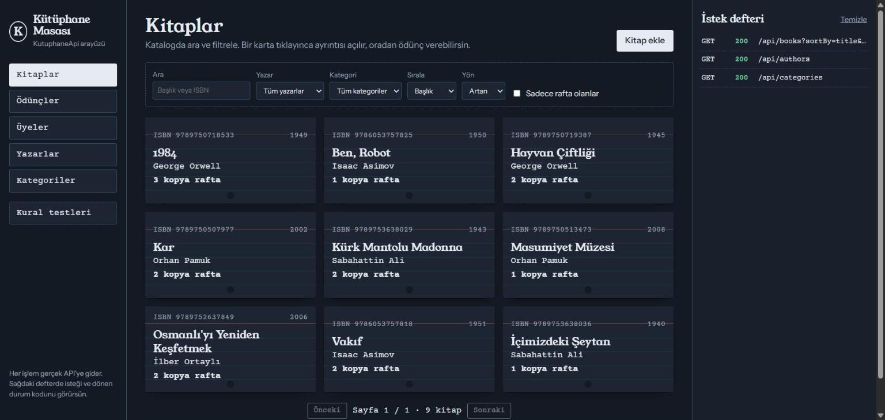
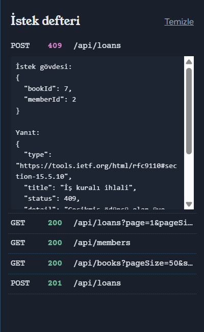
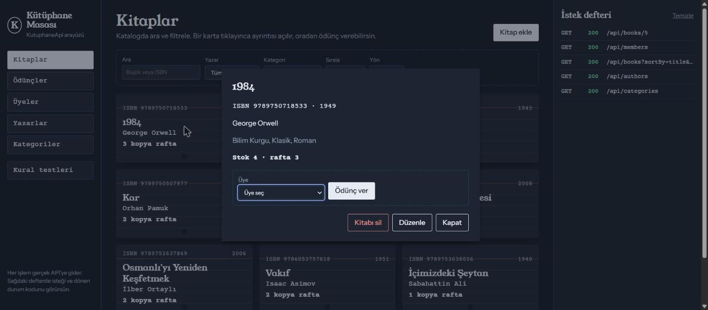
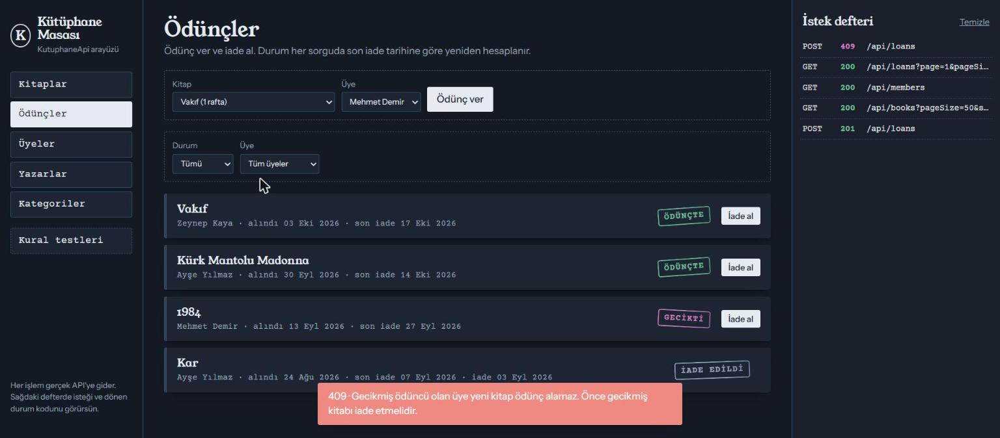
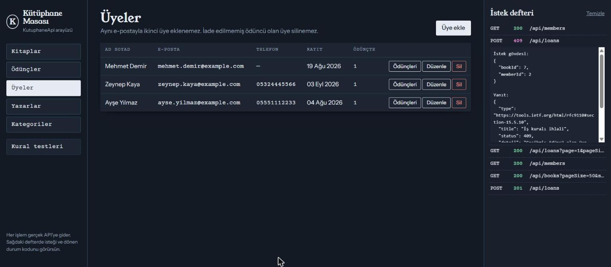
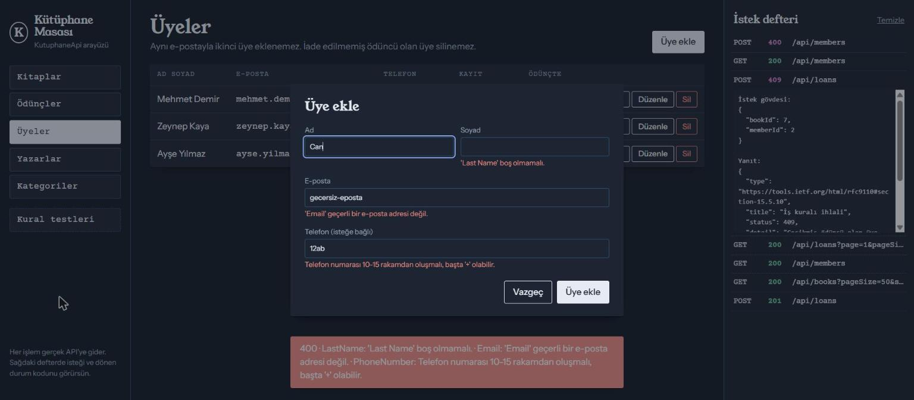
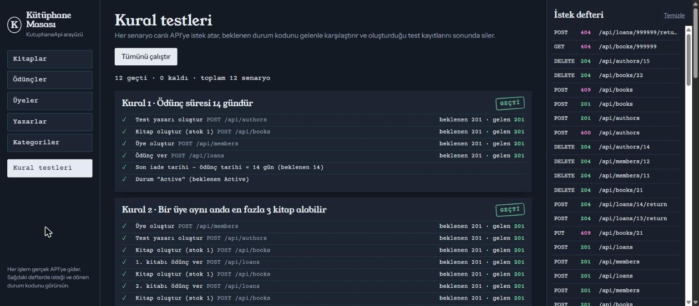
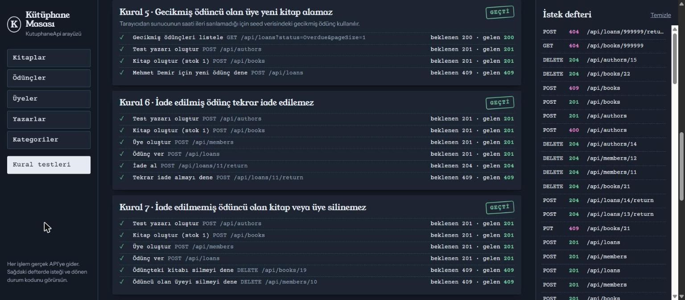

# KutuphaneApi

.NET 10 ve ASP.NET Core ile yazılmış bir **Kütüphane Yönetim REST API'si** ve ona bağlı bir web arayüzü. Yazarları, kategorileri, kitapları, üyeleri ve ödünç/iade işlemlerini iş kurallarıyla birlikte yönetir.

Öğrenme amaçlı bir projedir. Her adımın açıklaması, yeni kavramlar ve alıştırmalar [`NOTLAR.md`](NOTLAR.md) dosyasındadır.



## İçindekiler

1. [Hızlı başlangıç](#1-hızlı-başlangıç)
2. [Kurulum](#2-kurulum)
3. [Uygulamayı çalıştırma ve durdurma](#3-uygulamayı-çalıştırma-ve-durdurma)
4. [Örnek veri](#4-örnek-veri)
5. [Web arayüzünü kullanma](#5-web-arayüzünü-kullanma)
6. [API'yi Scalar ile deneme](#6-apiyi-scalar-ile-deneme)
7. [API'yi .http dosyasıyla deneme](#7-apiyi-http-dosyasıyla-deneme)
8. [API'yi komut satırından deneme](#8-apiyi-komut-satırından-deneme)
9. [Testler](#9-testler)
10. [Veritabanı ve migration komutları](#10-veritabanı-ve-migration-komutları)
11. [Git ile adımları inceleme](#11-git-ile-adımları-inceleme)
12. [Sık karşılaşılan sorunlar](#12-sık-karşılaşılan-sorunlar)
13. [Başvuru: endpoint'ler, kurallar, proje yapısı](#13-başvuru)

---

## 1. Hızlı başlangıç

PowerShell'de proje klasörüne gir ve üç komutu çalıştır:

```powershell
cd C:\Users\Efe\Desktop\Deneme
dotnet tool restore
dotnet run --project KutuphaneApi
```

Konsolda `Now listening on: http://localhost:5041` yazısını görünce tarayıcıda şu adresleri açabilirsin:

| Adres | Ne açılır |
|---|---|
| **http://localhost:5041/** | Kütüphane web arayüzü |
| http://localhost:5041/scalar | API'yi tek tek denemek için Scalar arayüzü |
| http://localhost:5041/openapi/v1.json | API'nin OpenAPI (JSON) dokümanı |

Uygulamayı kapatmak için terminalde `Ctrl+C`.

---

## 2. Kurulum

### Gereksinimler

- **.NET 10 SDK** (başka bir şey kurmana gerek yok; SQLite dosya tabanlıdır, sunucu kurulumu istemez)
- İsteğe bağlı: VS Code (+ REST Client eklentisi), Visual Studio 2022+ veya Rider

Kurulu SDK'ları görmek için:

```powershell
dotnet --list-sdks          # listede 10.x.x olmalı
dotnet --version
```

### İlk kurulum komutları

```powershell
cd C:\Users\Efe\Desktop\Deneme
dotnet tool restore                  # .config/dotnet-tools.json'daki dotnet-ef aracını kurar (sadece bu proje için)
dotnet restore KutuphaneApi.slnx     # NuGet paketlerini indirir (build zaten otomatik yapar)
dotnet build KutuphaneApi.slnx       # Tüm çözümü derler: 0 hata, 0 uyarı beklenir
```

> Tüm komutlar `Deneme` klasöründe çalıştırılır. `KutuphaneApi.slnx` hem API'yi hem test projesini içerir.

---

## 3. Uygulamayı çalıştırma ve durdurma

| Ne yapmak istiyorsun | Komut |
|---|---|
| Normal çalıştır (HTTP, port 5041) | `dotnet run --project KutuphaneApi` |
| HTTPS ile çalıştır (https://localhost:7086) | `dotnet run --project KutuphaneApi --launch-profile https` |
| Başka bir portta çalıştır | `dotnet run --project KutuphaneApi --urls http://localhost:5050` |
| Kod değişince otomatik yeniden başlat | `dotnet watch --project KutuphaneApi` |
| Durdur | Terminalde `Ctrl+C` |

Notlar:

- HTTPS profili ilk kez kullanılıyorsa geliştirme sertifikasını bir kez güvenilir yap: `dotnet dev-certs https --trust`
- `dotnet watch` açıkken başka bir terminalde `dotnet build` veya `dotnet test` çalıştırma; çalışan uygulama `bin/` klasöründeki dosyaları kilitler (bkz. [Sık karşılaşılan sorunlar](#12-sık-karşılaşılan-sorunlar)).
- Uygulama **Development** ortamında açıldığında bekleyen migration'ları uygular ve veritabanı boşsa örnek veriyi ekler. Scalar ve OpenAPI dokümanı da sadece Development ortamında açıktır.

### Verileri sıfırlama

Uygulamayı kapat, veritabanı dosyalarını sil ve uygulamayı yeniden başlat. Örnek veri baştan oluşturulur:

```powershell
Remove-Item KutuphaneApi\kutuphane.db*
dotnet run --project KutuphaneApi
```

---

## 4. Örnek veri

Veritabanı ilk oluştuğunda şu kayıtlar eklenir. Id'ler aşağıdaki gibi olur; komut örneklerinde bu Id'ler kullanılıyor.

**Yazarlar:** 1 Orhan Pamuk · 2 Sabahattin Ali · 3 George Orwell · 4 Isaac Asimov · 5 İlber Ortaylı

**Kategoriler:** 1 Roman · 2 Klasik · 3 Bilim Kurgu · 4 Tarih

**Kitaplar** (Id · başlık · stok):

| Id | Kitap | Stok | | Id | Kitap | Stok |
|---|---|---|---|---|---|---|
| 1 | Kar | 2 | | 6 | Hayvan Çiftliği | 2 |
| 2 | Masumiyet Müzesi | 1 | | 7 | Vakıf | 2 |
| 3 | Kürk Mantolu Madonna | 3 | | 8 | Ben, Robot | 1 |
| 4 | İçimizdeki Şeytan | 1 | | 9 | Osmanlı'yı Yeniden Keşfetmek | 2 |
| 5 | 1984 | 4 | | | | |

**Üyeler ve ödünçler:**

| Üye | Durumu | Ne denemeye uygun |
|---|---|---|
| 1 · Ayşe Yılmaz | "Kar"ı iade etmiş (ödünç 1), "Kürk Mantolu Madonna"yı ödünçte tutuyor (ödünç 2) | Aynı kitabı tekrar alma (kural 4), iade alma |
| 2 · Mehmet Demir | "1984"ün iade tarihi geçmiş (ödünç 3, **Gecikti**) | Gecikmiş üyeye ödünç verme (kural 5) |
| 3 · Zeynep Kaya | Ödüncü yok | Sorunsuz ödünç verme, 3 kitap limiti (kural 2) |

---

## 5. Web arayüzünü kullanma

**http://localhost:5041/** adresini aç. Solda bölümler, ortada seçili ekran, sağda **İstek defteri** var.

### İstek defteri (sağ panel)

Arayüzde yaptığın her işlem bir HTTP isteğidir ve burada en üste eklenir:

```
POST  409  /api/loans
```

- Renkler: yeşil `2xx` başarılı, mor `4xx` istemci hatası (400/404/409), kırmızı `5xx` sunucu hatası.
- Bir satıra tıklayınca **gönderilen JSON** ve **gelen yanıt** açılır. Hata yanıtlarında `title`, `detail` ve `errors` alanlarını burada görürsün.
- "Temizle" listeyi boşaltır (veritabanını etkilemez).

Hatalar ayrıca ekranın altında kırmızı bir bildirimle gösterilir: `409 · Bu kitabın müsait kopyası yok.`



### Kitaplar

1. **Arama ve filtre:** "Ara" kutusuna başlık veya ISBN'in bir parçasını yaz (örn. `kar`, `97860`). Yazar, kategori, sıralama (başlık/yayın yılı), yön ve "Sadece rafta olanlar" seçenekleri listeyi anında günceller.
2. **Sayfalar:** Altta "Önceki / Sonraki" düğmeleri ve toplam kitap sayısı var. Sayfa başına 12 kitap gösterilir.
3. **Ayrıntı:** Bir karta tıkla. Yazar, kategoriler, stok ve raftaki kopya sayısı görünür.
4. **Ödünç ver:** Ayrıntı penceresinde üye seç ve "Ödünç ver"e bas. Bildirimde son iade tarihi (bugün + 14 gün) yazar.
5. **Kitap ekle:** Sağ üstteki "Kitap ekle" düğmesi. ISBN tam 13 rakam olmalı; yazar seçmek zorunlu, kategoriler isteğe bağlı.
6. **Düzenle / Sil:** Ayrıntı penceresindeki düğmeler. Ödünçteki kitap silinemez (409). Stok, ödünçteki kopya sayısının altına indirilemez (409).



### Ödünçler

1. **Ödünç ver:** Üstteki formda kitap ve üye seç, "Ödünç ver"e bas. Kitap listesinde her kitabın yanında raftaki kopya sayısı yazar.
2. **Liste:** Her ödünç bir iade fişi olarak görünür. Fişte kitap, üye, alınma, son iade ve (varsa) iade tarihi ile bir durum damgası vardır:
   - **Ödünçte** (yeşil): iade edilmemiş, süresi dolmamış
   - **Gecikti** (mor): iade edilmemiş, son iade tarihi geçmiş
   - **İade edildi** (gri)
3. **Filtre:** Duruma ve üyeye göre süz. Örneğin "Gecikti" seçince sadece gecikmiş ödünçler kalır.
4. **İade al:** Fişin sağındaki düğme. Zaten iade edilmiş ödünçte bu düğme görünmez.



*Mehmet'e ödünç verilmeye çalışıldı: API 409 döndü, defterde `POST 409 /api/loans` satırı ve altta hata bildirimi görünüyor.*

### Üyeler, Yazarlar, Kategoriler

- Tabloda kayıtlar listelenir. Sağ üstteki düğmeyle yeni kayıt eklenir; satırdaki "Düzenle" ve "Sil" düğmeleri kaydı değiştirir veya siler.
- **Üyeler → "Ödünçleri":** Üyenin tüm ödünç geçmişini fişler halinde açar; buradan da iade alınabilir.
- Formlarda tarayıcının kendi kontrolü bilerek kapalı. Boş ad veya hatalı e-posta girersen hatayı API verir (400) ve mesaj ilgili alanın altında görünür.





### Kural testleri

1. Soldan **Kural testleri**'ni aç ve **Tümünü çalıştır**'a bas.
2. 12 senaryo sırayla çalışır: 9 iş kuralı, doğrulama (400), benzersiz ISBN (409) ve olmayan kayıt (404).
3. Her adımda yapılan istek, **beklenen** ve **gelen** durum kodu yazar. Senaryo sonunda **GEÇTİ**, **KALDI** veya **ATLANDI** damgası basılır; en üstte toplam sonuç görünür.
4. Senaryolar kendi test yazarlarını, kitaplarını ve üyelerini oluşturur, bitince siler. Senin verilerin değişmez.
5. Kural 5 (gecikme) için tarayıcıdan sunucunun saati ileri sarılamadığı için örnek verideki gecikmiş ödünç (Mehmet) kullanılır. O kayıt yoksa senaryo "Atlandı" olur; [verileri sıfırlarsan](#verileri-sıfırlama) geri gelir.





### 5 dakikalık deneme turu

| # | Nerede | Ne yap | Beklenen sonuç |
|---|---|---|---|
| 1 | Kitaplar | "Ara" kutusuna `kar` yaz | Sadece "Kar" kalır |
| 2 | Kitaplar | "1984" kartına tıkla | Stok 4, rafta 3 |
| 3 | Ödünçler | Kitap: Vakıf, Üye: Zeynep Kaya → Ödünç ver | Bildirim: "Ödünç verildi. Son iade tarihi: …" |
| 4 | Ödünçler | Kitap: Vakıf, Üye: Mehmet Demir → Ödünç ver | `409 · Gecikmiş ödüncü olan üye…` |
| 5 | Ödünçler | Durum: Gecikti | Sadece Mehmet'in 1984 fişi |
| 6 | Ödünçler | Ayşe'nin "Kürk Mantolu Madonna" fişinde "İade al" | Damga "İade edildi" olur |
| 7 | Yazarlar | Orhan Pamuk satırında "Sil" | `409 · Kitabı olan yazar silinemez…` |
| 8 | Üyeler | "Üye ekle" → e-posta alanına `abc` yaz → kaydet | E-posta alanının altında doğrulama hatası (400) |
| 9 | Kural testleri | "Tümünü çalıştır" | 12 geçti · 0 kaldı |

Her adımdan sonra sağdaki İstek defterine bakıp hangi isteğin gittiğini ve ne döndüğünü incele.

---

## 6. API'yi Scalar ile deneme

1. **http://localhost:5041/scalar** adresini aç.
2. Soldan bir endpoint seç (örn. `POST /api/loans`).
3. **Test Request** düğmesine bas, gövdeyi doldur:
   ```json
   { "bookId": 7, "memberId": 3 }
   ```
4. **Send** ile gönder. Durum kodu, başlıklar ve yanıt gövdesi aynı ekranda görünür.

Scalar sadece Development ortamında açıktır.

---

## 7. API'yi .http dosyasıyla deneme

[`KutuphaneApi/KutuphaneApi.http`](KutuphaneApi/KutuphaneApi.http) dosyasında her endpoint için hazır istekler var: başarılı örnekler ve bilerek hata üreten örnekler (400, 404, 409).

- **VS Code:** "REST Client" eklentisini kur, dosyayı aç, isteğin üstündeki **Send Request** yazısına tıkla.
- **Visual Studio / Rider:** Dosyayı aç, isteğin yanındaki yeşil ▶ simgesine tıkla.

Uygulamanın çalışıyor olması gerekir. Adres dosyanın ilk satırındaki `@KutuphaneApi_HostAddress` değişkeninden okunur.

---

## 8. API'yi komut satırından deneme

### PowerShell

Önce bu yardımcı fonksiyonu PowerShell penceresine bir kez yapıştır. Fonksiyon JSON'u UTF-8 gönderir, böylece Türkçe karakterler bozulmaz. Hata durumunda durum kodunu ve API'nin hata gövdesini (ProblemDetails) gösterir. Windows PowerShell 5.1 ve PowerShell 7'de çalışır.

```powershell
function Api($Method, $Path, $Body) {
    $params = @{ Method = $Method; Uri = "http://localhost:5041$Path"; ContentType = "application/json; charset=utf-8" }
    if ($Body) { $params.Body = [Text.Encoding]::UTF8.GetBytes(($Body | ConvertTo-Json -Depth 5)) }
    try {
        $result = Invoke-RestMethod @params
        if ($result) { $result | ConvertTo-Json -Depth 5 } else { "Başarılı (yanıt gövdesi yok)" }
    }
    catch {
        $response = $_.Exception.Response
        $message = $_.ErrorDetails.Message
        if (-not $message -and $response) {
            $message = (New-Object IO.StreamReader($response.GetResponseStream())).ReadToEnd()
        }
        "HATA $([int]$response.StatusCode): $message"
    }
}
```

Örnek çıktılar:

```
Api POST /api/loans @{ bookId = 7; memberId = 2 }
HATA 409: {"title":"İş kuralı ihlali","status":409,"detail":"Gecikmiş ödüncü olan üye yeni kitap ödünç alamaz. ..."}

Api POST /api/loans/2/return
Başarılı (yanıt gövdesi yok)
```

PowerShell penceresini kapatınca fonksiyon unutulur; yeni pencerede tekrar yapıştırman gerekir.

Sonra istekleri şöyle atabilirsin:

```powershell
# ---------- Yazarlar ----------
Api GET    /api/authors
Api GET    /api/authors/1
Api POST   /api/authors   @{ firstName = "Yaşar"; lastName = "Kemal"; birthYear = 1923 }
Api PUT    /api/authors/6 @{ firstName = "Yaşar"; lastName = "Kemal"; birthYear = 1922 }
Api DELETE /api/authors/6
Api DELETE /api/authors/1                                  # 409: kitabı olan yazar silinemez

# ---------- Kategoriler ----------
Api GET    /api/categories
Api POST   /api/categories @{ name = "Felsefe" }
Api POST   /api/categories @{ name = "roman" }             # 409: aynı ad zaten var
Api PUT    /api/categories/5 @{ name = "Felsefe ve Düşünce" }
Api DELETE /api/categories/5

# ---------- Kitaplar ----------
Api GET    "/api/books"
Api GET    "/api/books?search=kar"
Api GET    "/api/books?authorId=3&categoryId=2"
Api GET    "/api/books?onlyAvailable=true&sortBy=year&sortDirection=desc&page=1&pageSize=5"
Api GET    /api/books/5
Api POST   /api/books @{ title = "Beyaz Kale"; isbn = "9789750508479"; publishedYear = 1985; stockCount = 2; authorId = 1; categoryIds = @(1, 2) }
Api PUT    /api/books/10 @{ title = "Beyaz Kale"; isbn = "9789750508479"; publishedYear = 1985; stockCount = 3; authorId = 1; categoryIds = @(1) }
Api DELETE /api/books/10
Api GET    "/api/books?pageSize=100"                       # 400: sayfa boyutu en fazla 50

# ---------- Üyeler ----------
Api GET    /api/members
Api GET    /api/members/1
Api GET    /api/members/1/loans
Api POST   /api/members @{ firstName = "Can"; lastName = "Öztürk"; email = "can.ozturk@example.com"; phoneNumber = "+905551234567" }
Api PUT    /api/members/4 @{ firstName = "Can"; lastName = "Öztürk"; email = "can@example.com"; phoneNumber = $null }
Api DELETE /api/members/4
Api POST   /api/members @{ firstName = "X"; lastName = "Y"; email = "gecersiz" }   # 400: e-posta biçimi

# ---------- Ödünçler ----------
Api GET    /api/loans
Api GET    "/api/loans?status=Overdue"
Api GET    "/api/loans?memberId=1&status=Returned"
Api GET    /api/loans/2
Api POST   /api/loans @{ bookId = 7; memberId = 3 }        # 201: ödünç ver
Api POST   /api/loans @{ bookId = 7; memberId = 2 }        # 409: Mehmet'in gecikmiş ödüncü var
Api POST   /api/loans @{ bookId = 3; memberId = 1 }        # 409: Ayşe bu kitabı zaten almış
Api POST   /api/loans/2/return                             # 204: iade al
Api POST   /api/loans/2/return                             # 409: zaten iade edilmiş
```

> PowerShell 5.1'de `curl` aslında `Invoke-WebRequest`'in kısaltmasıdır. Gerçek curl'ü kullanmak istersen `curl.exe` yaz.

### Git Bash (curl)

```bash
curl -s http://localhost:5041/api/books
curl -s "http://localhost:5041/api/loans?status=Overdue"
curl -i -X POST http://localhost:5041/api/loans -H "Content-Type: application/json" -d '{"bookId":7,"memberId":3}'
curl -i -X POST http://localhost:5041/api/loans/2/return
curl -i -X DELETE http://localhost:5041/api/authors/1
```

`-i` yanıt başlıklarını ve durum kodunu da gösterir. Windows'ta curl'e komut satırından verilen Türkçe karakterler bozulabilir. Türkçe karakterli JSON'u bir dosyaya UTF-8 olarak kaydedip `--data-binary @dosya.json` ile gönder.

---

## 9. Testler

| Ne yapmak istiyorsun | Komut |
|---|---|
| Tüm testleri çalıştır | `dotnet test KutuphaneApi.slnx` |
| Sadece unit testler | `dotnet test KutuphaneApi.slnx --filter "FullyQualifiedName~Unit"` |
| Sadece integration testler | `dotnet test KutuphaneApi.slnx --filter "FullyQualifiedName~Integration"` |
| Tek bir test sınıfı | `dotnet test KutuphaneApi.slnx --filter "FullyQualifiedName~LoanServiceTests"` |
| Tek bir test (adının bir parçasıyla) | `dotnet test KutuphaneApi.slnx --filter "FullyQualifiedName~CreateAsync_MemberHasOverdueLoan"` |
| Her testin adını ve sonucunu göster | `dotnet test KutuphaneApi.slnx --logger "console;verbosity=detailed"` |
| Testleri listele (çalıştırmadan) | `dotnet test KutuphaneApi.slnx --list-tests` |

Beklenen sonuç: `Başarılı! - Başarısız: 0, Başarılı: 36`.

- **`KutuphaneApi.Tests/Unit`** (18 test): Servisler gerçek bir SQLite in-memory veritabanıyla test edilir. `FakeTimeProvider` ile saat ileri sarılarak gecikme kuralı da test edilir.
- **`KutuphaneApi.Tests/Integration`** (18 test): API `WebApplicationFactory` ile bellekte açılır ve gerçek HTTP istekleriyle test edilir. Testler senin `kutuphane.db` dosyana dokunmaz.

> Uygulama açıkken `dotnet test` çalıştırırsan build "dosya kilitli" hatası verebilir. Önce uygulamayı `Ctrl+C` ile kapat.

---

## 10. Veritabanı ve migration komutları

Veritabanı `KutuphaneApi/kutuphane.db` dosyasıdır. Bağlantı cümlesi `KutuphaneApi/appsettings.json` → `ConnectionStrings:DefaultConnection` içindedir.

| Ne yapmak istiyorsun | Komut |
|---|---|
| `dotnet-ef` aracını kur | `dotnet tool restore` |
| Aracın sürümünü gör | `dotnet ef --version` |
| Entity'de değişiklik sonrası yeni migration oluştur | `dotnet ef migrations add <MigrationAdi> --project KutuphaneApi --output-dir Data/Migrations` |
| Migration'ları listele | `dotnet ef migrations list --project KutuphaneApi` |
| Son (uygulanmamış) migration'ı geri al | `dotnet ef migrations remove --project KutuphaneApi` |
| Migration'ları veritabanına uygula | `dotnet ef database update --project KutuphaneApi` |
| Belirli bir migration'a geri dön | `dotnet ef database update <MigrationAdi> --project KutuphaneApi` |
| Veritabanını sil | `dotnet ef database drop --project KutuphaneApi --force` |
| Migration'ların üreteceği SQL'i gör | `dotnet ef migrations script --project KutuphaneApi` |

Development ortamında uygulama her açılışta bekleyen migration'ları kendisi uyguladığı için `database update` komutunu çalıştırman genelde gerekmez.

Örnek akış (yeni bir alan eklemek):

```powershell
# 1. Entities/Book.cs içine yeni bir özellik ekle, örn. public int? PageCount { get; set; }
dotnet ef migrations add AddBookPageCount --project KutuphaneApi --output-dir Data/Migrations
# 2. Oluşan Data/Migrations/*_AddBookPageCount.cs dosyasını incele
dotnet run --project KutuphaneApi    # açılışta migration otomatik uygulanır
```

---

## 11. Git ile adımları inceleme

Proje 0'dan 16'ya kadar adım adım geliştirildi; her adım ayrı bir commit.

```powershell
git log --oneline                    # tüm adımlar
git show --stat <commit-hash>        # bir adımda hangi dosyalar değişti
git show <commit-hash>               # bir adımın tam farkı (diff)
git diff                             # henüz commit edilmemiş kendi değişikliklerin
git restore <dosya>                  # bir dosyadaki kendi değişikliğini geri al ("Bilerek boz" alıştırmalarından sonra)
```

Önerilen okuma sırası ve her adımın açıklaması `NOTLAR.md` → **Son Rapor** ve **Adım Notları** bölümlerinde.

---

## 12. Sık karşılaşılan sorunlar

**`MSB3021: ... KutuphaneApi.exe üzerine kopyalanamıyor ... being used by another process`**
Uygulama (veya `dotnet watch`) hâlâ çalışıyor ve dosyaları kilitliyor. Çalıştığı terminalde `Ctrl+C` ile kapat. Hangi sürecin kilitlediği hata mesajında yazar, örn. `KutuphaneApi (17280)`. Gerekirse o süreci kapat:

```powershell
Stop-Process -Id 17280
```

**`Failed to bind to address http://127.0.0.1:5041: address already in use`**
5041 portu başka bir süreçte açık. Kim kullanıyor bak ve kapat, ya da başka port kullan:

```powershell
Get-NetTCPConnection -LocalPort 5041 -State Listen | Select-Object OwningProcess
Stop-Process -Id <OwningProcess>
# veya
dotnet run --project KutuphaneApi --urls http://localhost:5050
```

**`SQLite Error 1: 'no such table: ...'`**
Yeni bir migration derlenmeden uygulama çalıştırılmış. Önce `dotnet build KutuphaneApi.slnx`, sonra `dotnet run --project KutuphaneApi`. Düzelmezse [verileri sıfırla](#verileri-sıfırlama).

**Web arayüzü açılmıyor (`/` adresi 404 dönüyor)**
Çalışan uygulama, arayüz eklenmeden önceki bir derlemeden açılmış olabilir. Uygulamayı kapatıp `dotnet run --project KutuphaneApi` ile yeniden başlat.

**Arayüzde "Bu ekran yüklenemedi"**
API kapalı ya da farklı bir portta çalışıyor. Arayüzü API'nin çalıştığı adresten açtığından emin ol.

**Kural testlerinde "Kural 5 · Atlandı"**
Veritabanında gecikmiş ödünç kalmamış (örneğin Mehmet'in kitabını iade ettin). [Verileri sıfırla](#verileri-sıfırlama).

**Türkçe karakterli istekte `The JSON value could not be converted`**
Komut satırı Türkçe karakterleri bozmuştur. PowerShell'de yukarıdaki `Api` fonksiyonunu, Git Bash'te `--data-binary @dosya.json` yöntemini kullan.

---

## 13. Başvuru

### Endpoint'ler

| Kaynak | Endpoint'ler |
|---|---|
| Authors | `GET /api/authors`, `GET /api/authors/{id}`, `POST`, `PUT /{id}`, `DELETE /{id}` |
| Categories | `GET /api/categories`, `GET /{id}`, `POST`, `PUT /{id}`, `DELETE /{id}` |
| Books | `GET /api/books` (sayfalı; `search`, `authorId`, `categoryId`, `onlyAvailable`, `sortBy=title\|year`, `sortDirection=asc\|desc`, `page`, `pageSize` ≤ 50), `GET /{id}`, `POST`, `PUT /{id}`, `DELETE /{id}` |
| Members | `GET /api/members`, `GET /{id}`, `GET /{id}/loans`, `POST`, `PUT /{id}`, `DELETE /{id}` |
| Loans | `GET /api/loans` (sayfalı; `status=Active\|Overdue\|Returned`, `memberId`, `bookId`), `GET /{id}`, `POST` (ödünç ver), `POST /{id}/return` (iade al) |

Sayfalı yanıt şekli: `{ "items": [...], "page": 1, "pageSize": 10, "totalCount": 9, "totalPages": 1 }`

### Durum kodları

| Kod | Ne zaman |
|---|---|
| `200 OK` | Okuma başarılı |
| `201 Created` | Kayıt oluşturuldu; `Location` başlığı yeni kaydın adresini verir |
| `204 No Content` | Güncelleme, silme veya iade başarılı (gövde boş) |
| `400 Bad Request` | Doğrulama hatası; `errors` alanında alan bazlı mesajlar |
| `404 Not Found` | Kayıt bulunamadı |
| `409 Conflict` | İş kuralı ihlali veya benzersizlik çakışması |

Tüm hatalar `application/problem+json` (ProblemDetails) biçimindedir:

```json
{ "title": "İş kuralı ihlali", "status": 409, "detail": "Bu kitabın müsait kopyası yok.", "traceId": "..." }
```

### İş kuralları

1. Ödünç süresi 14 gündür.
2. Bir üyenin aynı anda en fazla 3 iade edilmemiş ödüncü olabilir.
3. Müsait kopyası olmayan kitap ödünç verilemez.
4. Üye aynı kitabı iade etmeden ikinci kez ödünç alamaz.
5. Gecikmiş ödüncü olan üye yeni ödünç alamaz.
6. İade edilmiş ödünç tekrar iade edilemez.
7. İade edilmemiş ödüncü olan kitap veya üye silinemez.
8. Kitabı olan yazar silinemez.
9. Kitap stoğu, o an ödünçte olan kopya sayısının altına düşürülemez.

Ayrıca ISBN, üye e-postası ve kategori adı benzersizdir (409). Müsait kopya sayısı ve ödünç durumu veritabanında saklanmaz, her sorguda hesaplanır.

### Teknolojiler

- ASP.NET Core 10 (controller tabanlı Web API, minimal hosting)
- EF Core 10 + SQLite
- FluentValidation (servislerde elle çağrılır)
- OpenAPI + Scalar
- Web arayüzü: HTML + CSS + JavaScript (framework ve derleme adımı yok)
- xUnit, SQLite in-memory, `WebApplicationFactory`, `FakeTimeProvider`

### Proje yapısı

```
Deneme/
├── KutuphaneApi.slnx         Çözüm dosyası (iki proje)
├── NOTLAR.md                 Adım adım öğrenme notları ve son rapor
├── docs/images/              README ekran görüntüleri
├── .config/dotnet-tools.json dotnet-ef yerel aracı
├── KutuphaneApi/
│   ├── Controllers/          HTTP katmanı: route, durum kodu
│   ├── Services/             İş kuralları, doğrulama çağrısı, EF Core sorguları
│   ├── Data/                 AppDbContext, Fluent API yapılandırmaları, migration'lar, seed
│   ├── Entities/             Tablo karşılıkları
│   ├── Dtos/                 API'nin aldığı ve döndürdüğü veri şekilleri (record)
│   ├── Mappings/             Elle yazılmış entity → DTO projeksiyonları
│   ├── Validators/           FluentValidation kuralları
│   ├── Common/               Özel exception'lar, sayfalama
│   ├── Infrastructure/       GlobalExceptionHandler
│   ├── Extensions/           DI kayıtları
│   ├── wwwroot/              Web arayüzü
│   ├── appsettings.json      Bağlantı cümlesi ve log ayarları
│   └── KutuphaneApi.http     Hazır istek örnekleri
└── KutuphaneApi.Tests/
    ├── Unit/                 Servis testleri
    └── Integration/          Uçtan uca HTTP testleri
```
